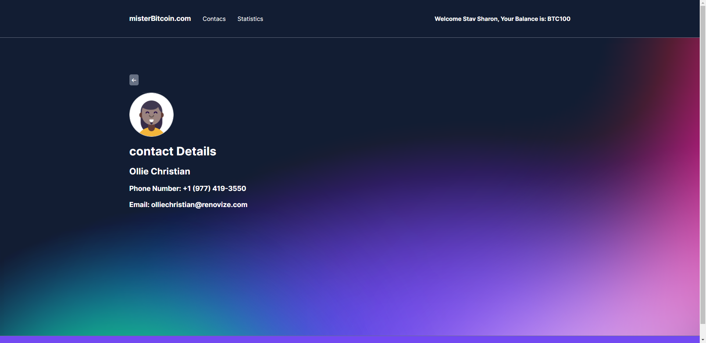
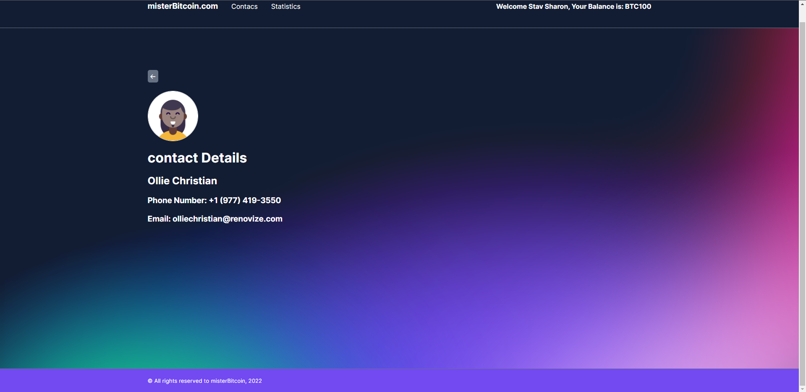

# Mister Bitcoin

### A digital wallet app for keeping and transfering Bitcoins.
<br/> 

### Main Technologies:
<a href="https://www.w3schools.com/html/" target="_blank" rel="noreferrer"> 
     
</a>
<a href="https://sass-lang.com" target="_blank" rel="noreferrer"> 
     
</a>  
<a href="https://developer.mozilla.org/en-US/docs/Web/JavaScript" target="_blank" rel="noreferrer"> 
     
</a>  
<a href="https://vuejs.org/" target="_blank" rel="noreferrer"> 
     
</a> 
<a href="https://vuex.vuejs.org/" target="_blank" rel="noreferrer"> 
     
</a>

<br/> 

### Key Features:
1. A logged in user can transfer Bitcoins from his balance to any of his contacts.
2. The user can edit, add and remove contacts.
3. The app uses an API to fetch and display information about the trade volume and exchange rate of Bitcoin.

## App Pages
<br/>

### 1. Home Page
<br/>

<br/>
<br/>

<br/>
<br/>

### 2. Contacts Page
<br/>

<br/>
<br/>

<br/>
<br/>

<br/>
<br/>

<br/>
<br/>

### 3. Contact Info Example Page
<br/>

<br/>
<br/>

<br/>
<br/>

### 4. Contact Add/Edit Page
<br/>

#### Edit Page
<br/>

<br/>
<br/>

<br/>
<br/>

#### Add Page
<br/>

<br/>
<br/>

<br/>
<br/>

### 5. Statistics Page
<br/>

<br/>
<br/>

<br/>
<br/>

## Recommended IDE Setup

[VSCode](https://code.visualstudio.com/) + [Vetur](https://marketplace.visualstudio.com/items?itemName=octref.vetur).

## Customize configuration

See [Vite Configuration Reference](https://vitejs.dev/config/).

## Project Setup

```sh
npm install
```

### Compile and Hot-Reload for Development

```sh
npm run dev
```

OR:

```sh
npm start
```


### Compile and Minify for Production

```sh
npm run build
```